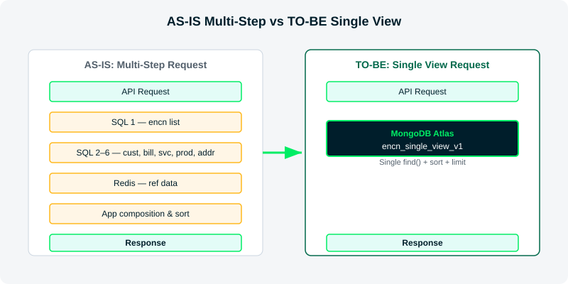
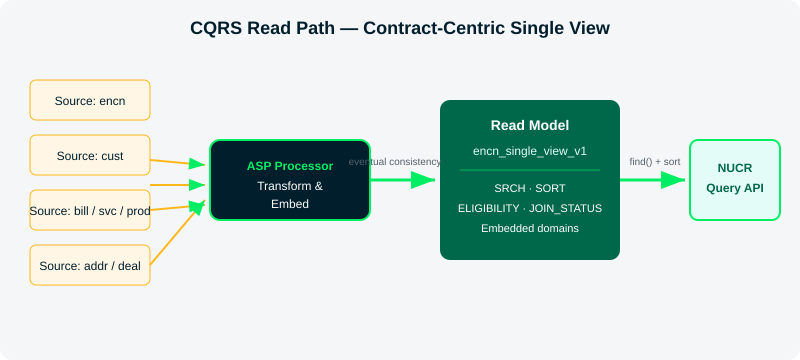
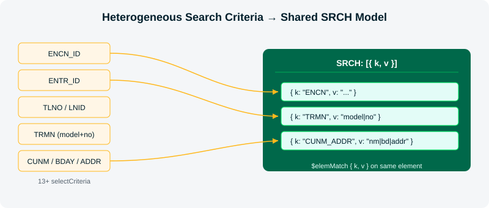
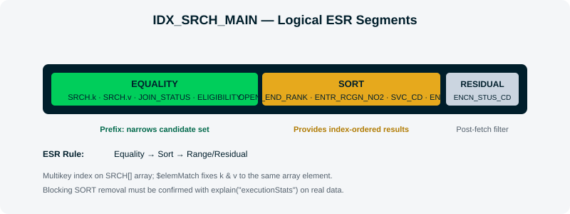
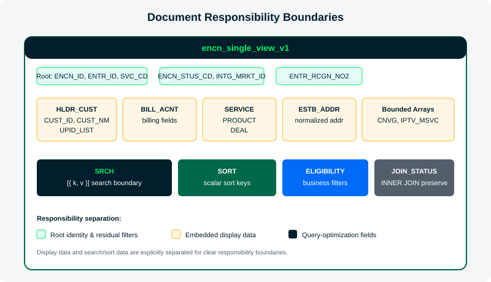
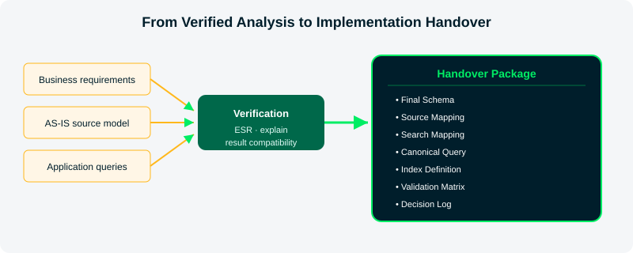

# 1 요약

본 리포트는 LG Uplus가 NUCR 가입계약 조회를 효율적인 Single View로 구현할 수 있도록, 업무 요건·데이터 관계·애플리케이션 조회 조건을 하나의 기준으로 통합한 최종 데이터 모델과 구현 규칙을 정의합니다. 최종 모델은 가입계약 `ENCN_ID`를 문서·조회·정렬·페이징의 기본 단위로 삼고, 13종 이상의 식별자성 조회 조건을 `SRCH` 검색 속성으로 표준화하며, 업무 정렬값은 스칼라 필드로 사전 계산합니다. UPID는 계약자 고객 정보에 포함하고, 기존 조회의 필수 관계와 업무 필터는 `JOIN_STATUS`와 `ELIGIBILITY`로 보존합니다. 공용 인덱스는 기본 후보로 제시하되 운영 적용 여부는 실제 데이터의 실행계획과 성능 측정으로 확정합니다.

PoC에서는 ASP를 통해 원천 데이터 변경을 이 Single View에 반영할 수 있음을 실증했습니다.

따라서 본 리포트의 결과는 단순한 플랫폼 전환안이 아니라, NUCR 개발팀이 후속 구현과 검증에 직접 사용할 수 있는 문서 구조, 원천 매핑, 검색조건 변환, 정렬·페이징, 인덱스 적용 및 검증 기준입니다.

# 2 배경

## 2.1 NUCR 서비스와 모델 전환 필요성

NUCR는 모바일·홈·기업 시스템에 분산된 가입계약, 고객, 청구, 서비스와 상품 정보를 통합하여 외부 소비자에게 가입계약 목록을 제공하는 CQRS 기반 조회 서비스입니다. 주요 인터페이스인 `/nucr/cmcc/encns/v1/page`는 계약번호, 전화번호, 고객번호, 고객명 등 서로 다른 검색 조건을 입력받지만, 최종적으로는 해당 조건과 연관된 가입계약 목록을 업무 정렬 규칙과 페이징 조건에 따라 반환합니다. 원천 도메인의 변경은 작은 단위로 분산 유입되는 반면 조회 응답은 여러 도메인의 결합 정보를 한 번에 요구하므로, 원천 구조를 그대로 복제하기보다 가입계약을 경계로 재구성한 Read Model이 필요합니다.

현행 애플리케이션은 Java/JPA와 Kubernetes 기반이며, 관계형 데이터는 MariaDB에서, 일부 참조 데이터는 Redis에서 조회합니다. 실제 DB Trace 사례에서 단일 API 요청은 19개의 SQL과 1회의 Redis 조회를 순차 실행했고, 전체 162ms 중 DB 구간이 41ms였습니다. 검색 조건별 평균 응답은 30ms 이내였지만 최대값은 1초에서 282초까지 관찰되어, 평균보다 다단계 처리와 특정 데이터 분포·실행계획에서 급증하는 Tail Latency가 핵심 과제로 확인되었습니다.

PoC는 13개 관계형 테이블을 컬렉션별로 단순 이전하는 대신, MongoDB Atlas에서 API 반환 단위에 맞춘 계약 중심 Single View로 전환하여 조회 시점의 반복 JOIN, 데이터베이스 왕복과 애플리케이션 조합을 줄이는 방향을 검토했습니다.

| AS-IS 과제 | 구조적 원인 | 최종 모델의 대응 방향 |
| --- | --- | --- |
| 반복 DB 호출 | 목록 조회 후 상세·참조 데이터 추가 조회 | 계약 단위 Single View로 요청 경로 통합 |
| 다중 테이블 JOIN | 고객·청구·서비스·상품·주소가 정규화된 테이블에 분산 | 조회에 반복 사용되는 bounded 데이터를 문서에 임베딩 |
| 검색 조건 증가 | selectCriteria별 서로 다른 WHERE 조건 | SRCH Attribute Pattern으로 검색 경계 통합 |
| 동적 정렬 | CASE 기반 업무 우선순위와 페이징 정렬 | 스칼라 SORT 키를 적재 시점에 계산 |
| 인덱스 증가 위험 | 검색 진입점별 전용 ESR 인덱스 필요 | SRCH 기반 공용 Multikey 인덱스로 수렴 |

Figure 1은 현행 다단계 조회와 목표 Single View 조회의 차이를 보여줍니다.



*Figure 1: Comparison of the multi-step AS-IS request path and the target contract-centric request path.*

## 2.2 목표 아키텍처와 적용 원칙

목표 구조는 `ENCN_ID`를 중심으로 고객, 청구계정, 서비스, 상품, 상태, 주소와 조회용 파생 값을 Single View에 배치하여 CQRS의 Query 영역을 조회 패턴에 맞게 최적화합니다. 조회 시점의 JOIN을 Read Model 생성 시점의 데이터 조합으로 이동하면 API는 원천 관계를 매 요청마다 다시 해석하지 않고 계약 문서를 검색·정렬하는 데 집중할 수 있습니다. 다만 모델 구조만으로 응답시간이나 처리량의 개선 폭을 확정하지 않으며, 실제 데이터 분포와 조회 조건을 반영한 실행계획 및 부하 테스트로 검증해야 합니다.

Figure 2는 원천 도메인의 변경이 계약 중심 Read Model을 거쳐 조회 API에 제공되는 구조를 보여줍니다.



*Figure 2: CQRS read path based on a contract-centric Single View.*

문서 모델은 신규 식별자, 서비스 속성, 검색 조건과 응답 필드를 Aggregate 내부에 단계적으로 추가하고, 필요하면 `schema_version`으로 기존·신규 문서를 병행할 수 있어 다수 테이블의 DDL, JOIN, ORM 매핑과 배포 순서를 동시에 변경하는 부담을 줄입니다. 이는 스키마 통제를 제거한다는 의미가 아니며, 필수 필드와 타입의 Schema Validation, 하위 호환 읽기, 문서 재구축 절차, 인덱스·검색 키·API 계약 변경의 영향 분석과 회귀 검증이 함께 필요합니다. 이러한 접근은 기존 RDB 환경에서 어려웠던 스키마 변경 가능성과 운영 편의성을 확인한다는 프로젝트 성공 기준, 그리고 다른 BSS·OSS 시스템에 재사용할 참조 구조를 마련한다는 초기 목표에도 부합합니다.

NUCR의 확장 가치는 MongoDB 사용 자체가 아니라, 반복 JOIN이 존재하고 Aggregate 경계가 명확하며 데이터 중복과 eventual consistency를 수용할 수 있는 Single View 워크로드에 동일한 설계 원칙을 적용할 수 있다는 점에 있습니다.

| 관점 | NUCR에서 기대하는 변화 | 확장 적용 조건 |
| --- | --- | --- |
| 도메인 변경 | 신규 속성과 검색 조건을 계약 문서에 단계적으로 반영 | 문서 버전, Validation과 하위 호환 정책 정의 |
| 조회 경로 | 다단계 SQL·JOIN·ORM 조합을 계약 중심 조회로 단순화 | 명확한 Aggregate와 API 회귀 검증 가능 |
| CQRS | 쓰기 모델과 별도로 조회 목적의 Single View 구성 | 데이터 중복과 비동기 반영을 수용할 수 있음 |
| 조회 확장 | 식별자성 검색을 SRCH 속성으로 표준화 | 선택도, 정렬과 인덱스를 실제 데이터로 검증 |
| 변경 수렴 | 원천 변경 후 Read Model을 최종 상태로 수렴 | 허용 지연, 멱등성, 재처리 기준 정의 |
| 서비스 확산 | 유사한 Single View 워크로드에 설계 원칙 재사용 | 대표 API로 모델 적합성과 운영 비용을 먼저 검증 |

확장 후보는 하나의 응답을 위해 여러 테이블이나 시스템을 반복 조회하고, 쓰기 모델과 읽기 모델의 요구가 다르며, 조회 결과의 업무 단위를 안정적으로 정의할 수 있는 서비스입니다. 반대로 강한 트랜잭션 일관성이 필수이거나 문서 경계를 안정적으로 정하기 어려운 업무에는 동일한 모델을 그대로 적용하지 않고 별도 설계를 검토해야 합니다.

# 3 PoC 목표 및 산출물

PoC의 목적은 운영 성능을 사전에 단정하는 것이 아니라, NUCR의 전체 업무 요건과 조회 패턴을 포괄하는 효율적인 Single View 모델을 정의하고 후속 구현팀에 전달하는 것입니다. 이를 위해 문서 경계와 필드 구조뿐 아니라 전체 selectCriteria의 검색 변환, 기존 업무 필터와 JOIN 의미, 정렬·페이징·pin 처리, 공용 인덱스 후보와 운영 데이터 검증 기준을 하나의 구현 기준으로 정리했습니다.

| 목표 | 최종 산출물 |
| --- | --- |
| 데이터 모델 정의 | ENCN_ID 중심 Single View의 문서 경계와 필드 구조 |
| 조회 구조 표준화 | 전체 selectCriteria를 지원하는 SRCH 검색 속성과 공용 조회 템플릿 |
| 업무 규칙 보존 | 필터, 정렬, 페이징, pin 처리 및 입력 정규화 규칙 |
| 구현 기준 제공 | AS-IS to TO-BE 매핑, 인덱스 후보와 검증 기준 |

# 4 최종 모델 도출 근거

최종 모델은 NUCR의 조회 결과 단위, 데이터 관계, 전체 검색조건, 정렬·페이징 규칙과 데이터 변경 특성을 함께 고려하여 도출했습니다. 이 장에서는 중간 검토 이력보다 최종 설계 결정을 뒷받침하는 업무·기술 근거를 설명합니다.

## 4.1 모델이 해결하는 문제

최종 모델이 해결해야 하는 문제는 다음 네 가지입니다. 첫째, 가입계약 목록 조회를 위해 여러 테이블과 참조 데이터를 반복 조회하는 경로를 단순화해야 합니다. 둘째, 13종 이상의 selectCriteria를 지원하면서도 조회 유형마다 새로운 인덱스가 추가되는 구조를 피해야 합니다. 셋째, 업무 우선순위 정렬과 페이징을 안정적으로 재현해야 합니다. 넷째, 원천 데이터가 순차적으로 도착하지 않더라도 계약 문서가 최종 상태로 수렴할 수 있어야 합니다.

## 4.2 가입계약 중심의 문서 경계

NUCR의 API 응답, 정렬과 페이징 단위는 가입계약입니다. 이에 따라 ENCN_ID를 문서의 기준 식별자이자 `_id`로 사용합니다. 고객, 청구계정, 서비스, 상품과 주소처럼 계약 목록 조회에 반복적으로 필요한 데이터는 계약 문서에 포함합니다. 결합상품과 IPTV처럼 계약별 건수가 제한되는 데이터는 배열로 포함하고, 독립적으로 계속 증가하는 이력이나 목록 조회에 상시 필요하지 않은 운영 데이터는 별도 컬렉션으로 관리합니다.

| 데이터 특성 | 배치 방식 | 판단 기준 |
| --- | --- | --- |
| 계약과 1:1이며 목록 응답에 반복 사용 | Embedded object | 계약 조회와 함께 읽히며 독립 수명주기가 없음 |
| 계약과 bounded 1:N | Embedded array | 실제 cardinality가 제한되고 문서 크기 관리 가능 |
| 독립적으로 증가하는 이력 | Separate collection | 무제한 배열 증가와 불필요한 문서 갱신 방지 |
| 작은 코드·정책 데이터 | Reference cache or bundle | 요청 시점 반복 조회 제거 |
| 큰 참조 데이터 | Separate reference collection | 대형 단일 문서와 과도한 캐시 무효화 방지 |

## 4.3 조회 모델 설계

실제 애플리케이션 소스에는 ENCN, ENTR, TLNO, LNID, TRMN, BILL, CUID, IPIN, CUNM, BRNO, CONO, COFR, UPID와 SPAM 등 다양한 검색 진입점이 존재합니다. 각 검색 필드를 문서의 서로 다른 경로에 두고 전용 인덱스를 생성하면 조회 유형과 정렬 변형의 조합만큼 인덱스가 증가합니다. 최종 모델은 식별자성 검색 값을 `SRCH[{k, v}]` 배열로 사전 계산하여 검색 경계를 하나의 패턴으로 통합합니다.

단일 등호 조건은 원천 값을 그대로 적재합니다. TRMN과 CUNM처럼 여러 등호 조건이 하나의 조회 의미를 구성하면 구분자로 결합한 복합값을 생성합니다. BRNO와 COFR는 원천 구분 코드에 따라 대응하는 SRCH 키만 생성합니다. UPID는 고객 기준으로 임베딩한 뒤 이메일을 검색 키로 노출합니다. SPAM은 ENCN 또는 ENTR 식별자를 검색 경계로 사용하고 상태 조건은 잔여 필터로 처리합니다.

Figure 3는 서로 다른 조회 조건이 공통 검색 구조로 수렴하는 과정을 보여줍니다.



*Figure 3: Consolidation of heterogeneous search criteria into the shared SRCH attribute model.*

## 4.4 정렬 및 인덱스 설계

AS-IS의 CASE 기반 정렬은 실행 시점에 업무 우선순위를 계산합니다. 최종 모델은 `SORT.OPEN_END_RANK`를 적재 시점에 계산하고, `ENTR_RCGN_NO2`, `SVC_CD`, `ENCN_ID`를 뒤따르는 스칼라 4키 정렬을 표준으로 사용합니다. 마지막 ENCN_ID는 동일한 앞선 정렬값을 가진 문서 사이에서 결과 순서를 결정하는 tie-breaker 역할을 하므로 페이지 경계를 안정화합니다.

검색 인덱스는 SRCH의 `k`와 `v`, 필수 JOIN·청구 플래그, 네 개의 정렬 키 순으로 구성합니다. SRCH 조건과 공통 플래그가 Equality 구간을 형성하고, 그 뒤의 스칼라 키가 정렬 순서를 제공합니다. ENCN_STUS_CD, SVC_CD의 특수 `$in` 조건과 마켓 조건은 검색 식별자로 후보군을 줄인 뒤 적용하는 잔여 필터입니다.

Figure 4는 공용 인덱스의 논리적 ESR 구성을 보여줍니다.



*Figure 4: Logical equality, sort, and residual-filter segments of the shared search index.*

## 4.5 변경 반영 전제

최종 모델은 여러 원천 이벤트가 하나의 계약 문서를 점진적으로 구성하는 read model입니다. 따라서 강한 트랜잭션 정합성을 요구하지 않으며, 원천 변경이 처리된 이후 Single View가 기대 상태로 수렴하는 eventual consistency를 전제로 합니다. ASP PoC를 통해 원천 데이터 변경을 Single View에 반영할 수 있음을 실증했으며, 구체적인 프로세서 구조와 검증 결과는 별도의 ASP 결과 리포트에서 다룹니다.

# 5 최종 NUCR 데이터 모델

이 장은 `encn_single_view_v1`의 문서 구조, 조회조건 변환 규칙과 인덱스 후보를 NUCR 구현 기준으로 정의합니다.

> [!NOTE]
> 이 장의 예시 값(ID, 이메일, 주소 등)은 구조 설명을 위한 가상 데이터이며 실제 운영 데이터가 아닙니다.

## 5.1 설계 불변 원칙

최종 모델은 다음 불변식을 유지합니다.

| 불변식 | 최종 정의 |
| --- | --- |
| Document identity | `_id`와 `ENCN_ID`는 가입계약 식별자를 사용 |
| Result unit | API 응답, 정렬과 페이징의 기본 단위는 가입계약 |
| Search boundary | 식별자성 검색은 `SRCH[{k, v}]`의 동일 원소 등호 매치로 시작 |
| Sort model | 정렬에 사용되는 값은 배열이 아닌 스칼라 필드로 저장 |
| Join semantics | 필수 관계의 존재 여부는 JOIN_STATUS로 명시적으로 보존 |
| Business eligibility | 청구·마켓 등 반복 필터는 ELIGIBILITY 또는 루트 스칼라로 표현 |
| Consistency | 원천 변경 처리 후 문서가 기대 상태로 수렴하는 eventual consistency 적용 |

## 5.2 문서 영역과 책임

최종 문서는 계약의 원천 식별자와 반복 필터를 루트에 두고, 고객·청구·서비스·상품·주소를 업무 단위의 서브도큐먼트로 구성합니다. 검색 전용 값은 SRCH, 정렬 전용 값은 SORT, 업무 노출 가능 여부는 ELIGIBILITY, 필수 관계 존재 여부는 JOIN_STATUS로 분리합니다. 이 분리는 표시 데이터와 조회 최적화용 데이터를 구분하여 모델의 책임을 명확하게 합니다.

| 문서 영역 | 주요 내용 | 조회 역할 |
| --- | --- | --- |
| Root | ENCN_ID, ENTR_ID, SVC_CD, ENCN_STUS_CD, INTG_MRKT_ID | 결과 식별과 잔여 필터 |
| HLDR_CUST | 고객 식별자, 고객명, 정규화 값, UPID_LIST | 고객 정보 반환과 UPID 참조 |
| BILL_ACNT | 청구계정 식별자와 상태 | 청구정보 반환과 청구 가능 여부 계산 |
| Embedded domains | 서비스, 상품, 딜, 주소, 상태 | 요청 시점 JOIN 제거 |
| Bounded arrays | 결합상품, IPTV 등 계약별 제한 목록 | 추가 조회 없이 목록 응답 구성 |
| SRCH | `{k, v}` 검색 속성 배열 | 모든 식별자성 검색의 공통 경계 |
| SORT | OPEN_END_RANK 등 스칼라 정렬 키 | 인덱스 기반 안정 정렬 |
| ELIGIBILITY | BILLING_ELIGIBLE, MVNO_YN | 반복 업무 필터 |
| JOIN_STATUS | 필수 고객·청구 관계 존재 여부 | 기존 INNER JOIN 의미 보존 |

Figure 5는 계약 루트 문서 안에서 각 영역이 담당하는 역할을 보여줍니다.



*Figure 5: Logical responsibility boundaries inside the contract-centric Single View document.*

최종 문서의 개념 구조는 다음과 같습니다.

```javascript title="encn_single_view_v1 개념 구조"
{
  _id: "<ENCN_ID>",
  ENCN_ID: "<ENCN_ID>",
  ENTR_ID: "<ENTR_ID>",
  SVC_CD: "<SVC_CD>",
  ENCN_STUS_CD: "<STATUS>",
  INTG_MRKT_ID: "<MARKET_ID>",
  ENTR_RCGN_NO2: "<RECOGNITION_NO>",

  HLDR_CUST: {
    CUST_ID: "<CUST_ID>",
    CUST_NM: "<CUSTOMER_NAME>",
    CUST_TYPE: "<PERSON_OR_COMPANY>",
    CUST_BDAY_NORM: "<YYMMDD>",
    CONO: "<COMPANY_NO>",
    UPID_LIST: [
      { UPID_EMAL_ADDR: "<EMAIL>" }
    ]
  },

  BILL_ACNT: { /* billing fields */ },
  ESTB_ADDR: { /* latest address and normalized fields */ },
  SERVICE: { /* service fields */ },
  PRODUCT: { /* product fields */ },
  DEAL: { /* deal fields */ },
  CNVG: { ACTIVE_LIST: [] },
  IPTV_MSVC: { LIST: [] },

  SRCH: [
    { k: "ENCN", v: "<ENCN_ID>" },
    { k: "CUID", v: "<CUST_ID>" },
    { k: "UPID", v: "<EMAIL>" }
  ],

  SORT: {
    OPEN_END_RANK: 0
  },

  ELIGIBILITY: {
    BILLING_ELIGIBLE: true,
    MVNO_YN: false
  },

  JOIN_STATUS: {
    HLDR_CUST_FOUND: true,
    BILL_ACNT_FOUND: true
  }
}
```

## 5.3 SRCH 속성 패턴

SRCH는 검색 입력을 표시용 업무 필드와 분리하여 공통 인덱스에 연결하는 검색 전용 배열입니다. 검색은 `k`와 `v`가 반드시 같은 배열 원소에서 일치하도록 `$elemMatch`를 사용합니다. 이 규칙이 지켜지지 않으면 서로 다른 배열 원소의 `k`와 `v`가 조합되는 잘못된 매치가 발생할 수 있습니다.

| selectCriteria | SRCH 키 | 값 생성 규칙 | 추가 조건 |
| --- | --- | --- | --- |
| ENCN | ENCN | ENCN_ID 원문 | 없음 |
| ENTR | ENTR | ENTR_ID 원문 | 없음 |
| TLNO | TLNO | 회선·상품 전화번호 원문 | 없음 |
| LNID | LNID | ENTR_RCGN_NO1 원문 | 없음 |
| TRMN | TRMN | 단말 모델과 단말번호 복합값 | 없음 |
| BILL | BILL | BILL_ACNT_ID 원문 | 청구 가능 플래그 |
| CUID | CUID | CUST_ID 원문 | 공통 필터 |
| IPIN | IPIN | IPIN_CI_NO 원문 | 공통 필터 |
| CUNM | CUNM_BDAY, CUNM_CONO 또는 CUNM_ADDR | 고객명과 생년월일·법인번호 또는 주소 복합값 | 개인·법인·주소 조회 분기 |
| BRNO | BRNO | 사업자번호, 종류 코드가 B일 때만 생성 | 없음 |
| CONO | CONO | 법인번호 | prefix 입력 정책 확인 필요 |
| COFR | COFR | 외국인·군번·여권 번호 | 허용 종류 코드일 때 생성 |
| UPID | UPID | UPID 이메일 | HLDR_CUST.UPID_LIST 임베딩 |
| SPAM | ENCN 또는 ENTR | 원래 식별자 검색 키 재사용 | 상태변경 코드와 사유 잔여 필터 |

다중 조건 변환 규칙은 네 가지로 표준화합니다.

| 규칙 | 적용 조건 | 처리 방식 | 적용 대상 |
| --- | --- | --- | --- |
| Composite Key | 모든 조건이 사용자 입력 등호 | 구분자로 결합한 단일 `v` 생성 | TRMN, CUNM_BDAY, CUNM_ADDR |
| Conditional Key | 조건 중 하나가 원천 구분 상수 | 구분값이 맞을 때만 키 생성 | BRNO, COFR |
| Bounded Embedding | 고객과 유계 자식 관계 | 고객 배열 임베딩 후 검색 키 생성 | UPID |
| Identifier + Residual | 고선택도 식별자와 비식별 조건 | 식별자로 경계를 만들고 나머지는 필터 | SPAM |

### 5.3.1 주소 LIKE 검색의 Equality 전환

주소 조회는 ESR을 적용하기 위해 기존의 prefix 검색을 사전 정규화된 동등 검색으로 전환한 대표 사례입니다. AS-IS Q5는 시군구를 `CCW_NM = '영등포구'`로 비교하면서 시·도명에는 `CTDO_NM LIKE '서울%'`를 적용했습니다. 최종 모델은 가입계약별 최신 설치주소를 `ESTB_ADDR`에 포함하고, 표시용 원본 `CTDO_NM`과 별도로 NUCR 주소 기준에 맞춘 `CTDO_NM_NORM`을 생성합니다. 이에 따라 동일한 업무 조건을 `CCW_NM = '영등포구' AND CTDO_NM_NORM = '서울'`의 동등 조건으로 표현할 수 있습니다.

| 구분 | AS-IS | 최종 모델 |
| --- | --- | --- |
| 주소 데이터 | 관계형 주소 테이블 조회 | 최신 설치주소를 `ESTB_ADDR`에 포함 |
| 시·도 조건 | `CTDO_NM LIKE '서울%'` | `CTDO_NM_NORM = '서울'` |
| 시군구 조건 | `CCW_NM = '영등포구'` | 정규화된 주소 복합값에 포함 |
| 검색 경계 | Equality와 prefix 범위 조건의 조합 | `SRCH.k = 'CUNM_ADDR'`, `SRCH.v = normalized composite value` |
| 인덱스 역할 | prefix 조건 이후 정렬 활용에 제약 가능 | 검색 키와 공통 플래그를 Equality 구간에 배치한 뒤 스칼라 정렬 키 연결 |

최종 조회에서는 고객명, 생년월일 6자리, 시군구와 정규화된 시·도명을 하나의 `CUNM_ADDR` 값으로 사전 계산합니다. 적재 로직과 조회 애플리케이션은 같은 정규화 및 결합 규칙을 사용해야 합니다.

```javascript title="AS-IS 주소 조건 vs 최종 SRCH 원소"
// AS-IS
CCW_NM = "영등포구"
CTDO_NM LIKE "서울%"

// Final SRCH element
{
  k: "CUNM_ADDR",
  v: "<CUSTOMER_NAME>|<BIRTH_DATE_6>|영등포구|서울"
}
```

이 설계는 임의의 부분 문자열 검색을 모두 동등 검색으로 바꾸는 것이 아닙니다. NUCR에서 지원하는 주소 검색 단위와 표기 변환 규칙을 먼저 정의하고, 그 규칙으로 결정적으로 계산할 수 있는 값만 `SRCH`에 적재합니다. 주소 약어, 공백, 행정구역 명칭 변경과 예외 표기는 하나의 버전 관리되는 정규화 규칙으로 관리해야 하며, 표시용 원본 주소는 별도로 보존합니다.

이 변환을 통해 `SRCH.k`, `SRCH.v`와 필수 공통 플래그를 인덱스의 Equality 구간에 두고, 이어지는 `SORT.OPEN_END_RANK`, `ENTR_RCGN_NO2`, `SVC_CD`, `ENCN_ID`를 정렬 구간으로 연결하는 설계가 가능합니다.

> [!WARNING]
> ESR은 인덱스 **설계 기준**이며 비차단 정렬(Blocking SORT 없음)의 실측 결과를 의미하지 않습니다. 운영 적용 전 CUNM 주소 조회에 대해 `explain("executionStats")`를 수행하고, 선택 인덱스, `totalKeysExamined`, `totalDocsExamined` 및 별도 `SORT` 단계의 유무를 확인해야 합니다.

근거 문서는 [NUCR 메인 조회 쿼리](https://drive.google.com/file/d/1pj4_Ia-8D2hZN10TCOXxSVcQ5IZwn-zp), [NUCR-PoC-Checkpoint2](https://docs.google.com/document/d/1h0oGoNdaMSIqvdTou-iGYuCeRzXSvK3fiDPGvnabk78), [NUCR-PoC-Datamodel-Final](https://docs.google.com/document/d/1thq2v3z5Vct2lSnUi_L-gYokn_Q0aJr70gZAeaJUnO4)입니다.

## 5.4 표준 조회 템플릿

애플리케이션은 selectCriteria에 따라 전체 쿼리를 별도로 작성하지 않고 `searchKey`, `searchValue`와 일부 잔여 필터만 변경하는 공통 템플릿을 사용합니다.

```javascript title="표준 조회 템플릿 (Canonical Query)"
db.encn_single_view_v1.find({
  SRCH: {
    $elemMatch: {
      k: searchKey,
      v: normalizedSearchValue
    }
  },
  "JOIN_STATUS.HLDR_CUST_FOUND": true,
  "JOIN_STATUS.BILL_ACNT_FOUND": true,
  "ELIGIBILITY.BILLING_ELIGIBLE": true,
  ENCN_STUS_CD: { $in: allowedStatusCodes },
  ...residualFilters
}).sort({
  "SORT.OPEN_END_RANK": 1,
  ENTR_RCGN_NO2: 1,
  SVC_CD: 1,
  ENCN_ID: 1
}).limit(pageSize)
```

입력 정규화와 SRCH 값 생성은 동일 규칙을 공유해야 합니다. 예를 들어 적재 시 생년월일을 6자리로 변환했다면 조회 입력도 같은 규칙으로 변환해야 하며, 주소와 복합키의 구분자·대소문자·공백 처리 역시 동일 모듈에서 관리해야 합니다.

## 5.5 공용 인덱스 전략

`IDX_SRCH_MAIN`은 SRCH 등호 검색, 공통 필터와 표준 정렬을 하나의 키 순서로 연결한 기본 인덱스 후보입니다. 실제 운영 적용 여부와 보조 인덱스 필요성은 selectCriteria별 실행계획과 데이터 분포를 확인한 후 확정합니다.

```javascript title="IDX_SRCH_MAIN 인덱스 정의"
db.encn_single_view_v1.createIndex(
  {
    "SRCH.k": 1,
    "SRCH.v": 1,
    "JOIN_STATUS.HLDR_CUST_FOUND": 1,
    "JOIN_STATUS.BILL_ACNT_FOUND": 1,
    "ELIGIBILITY.BILLING_ELIGIBLE": 1,
    "SORT.OPEN_END_RANK": 1,
    ENTR_RCGN_NO2: 1,
    SVC_CD: 1,
    ENCN_ID: 1
  },
  { name: "IDX_SRCH_MAIN" }
)
```

이 인덱스는 SRCH가 배열이므로 Multikey 인덱스입니다. 설계상 `$elemMatch`가 `k`와 `v`를 같은 원소에서 고정하고 정렬 필드는 모두 스칼라이므로 인덱스 순서로 결과를 제공하는 것을 목표로 합니다.

> [!WARNING]
> Blocking SORT 제거와 검색 효율은 설계만으로 확정하지 않습니다. 각 selectCriteria의 실제 데이터에 대해 `explain("executionStats")`로 반드시 확인해야 합니다.

## 5.6 정렬, 페이징 및 Pin 처리

표준 정렬은 `OPEN_END_RANK`, `ENTR_RCGN_NO2`, `SVC_CD`, `ENCN_ID` 순서입니다. ENCN_ID를 마지막 tie-breaker로 포함하여 같은 정렬값을 가진 계약의 순서가 요청마다 바뀌는 것을 방지합니다. 페이지 기반 조회가 아닌 seek pagination을 적용할 경우에도 이 네 개의 마지막 반환값을 다음 페이지 경계로 사용할 수 있습니다.

Pin 계약은 사용자 요청마다 달라지는 동적 조건이므로 문서나 인덱스에 사전 계산하지 않습니다. 먼저 표준 정렬로 결과를 조회한 뒤, 대상 ENCN_ID가 결과 집합에 포함되면 애플리케이션에서 첫 위치로 이동합니다. 이 방식은 pin 여부에 따라 인덱스 구성이 증가하는 것을 방지합니다.

## 5.7 업무 필터와 JOIN 의미 보존

기존 INNER JOIN은 고객 또는 청구계정 관계가 없는 계약을 결과에서 제외했습니다. Single View에서는 원천 관계 누락을 이유로 문서를 삭제하지 않고 `JOIN_STATUS.HLDR_CUST_FOUND`와 `JOIN_STATUS.BILL_ACNT_FOUND`를 저장한 뒤 조회 시 `true` 조건을 적용합니다. 이를 통해 원천 데이터 누락을 관찰할 수 있으면서도 기존 응답 의미를 유지합니다.

`ELIGIBILITY.BILLING_ELIGIBLE`과 `MVNO_YN`은 반복적으로 계산되는 업무 조건을 boolean으로 사전 계산합니다. 반면 SVC_CD와 ENCN_STUS_CD는 다중 프로파일 배열로 확장하지 않고 원천 스칼라를 유지하며, 조회 조건에 따라 equality 또는 `$in` 잔여 필터로 처리합니다.

## 5.8 참조 번들을 통한 반복 DBMS 호출 감소

NUCR의 조회 처리에는 가입계약 결과를 찾는 주 조회 외에도 통합마켓, 가입자 조회 기타정보, 서비스명, 결합상품명과 같은 작은 참조·정책성 데이터를 해석하기 위한 조회가 반복됩니다. 이 데이터는 건수가 작고 변경 빈도가 낮지만 요청마다 개별 테이블을 조회하면 전체 처리 과정의 DBMS Call과 네트워크 왕복이 증가합니다. 이 절의 목적은 계약 Single View를 다시 설명하는 것이 아니라, 이러한 반복 참조 조회를 요청 경로에서 제거하는 것입니다.

최종 모델은 `poc.nucr_ref_bundle`의 core Document 하나에 시장 정보, 가입자 조회 기타정보, 서비스 정보와 결합상품 정보를 구성합니다. 애플리케이션은 기동 시 또는 bundle의 `version`이 변경될 때 이 문서를 한 번 로드하고, 요청 처리 중에는 MongoDB를 다시 호출하지 않고 메모리의 lookup map을 사용합니다. 동일 데이터를 여러 조건으로 찾는 경우에는 `byId`, `byMvnoEnprYn`, `byInfoCdAndKindCd`, `byKindCdAndGid`, `bySvcCd`, `byCnvgCd`와 같은 접근 경로를 bundle 내부에 사전 구성합니다.

| 반복 조회 대상 | AS-IS 처리 | TO-BE 처리 | 요청 시점 DBMS Call |
| --- | --- | --- | --- |
| 통합마켓 | MVNO 여부 또는 `INTG_MRKT_ID`로 테이블 조회 | `market.byMvnoEnprYn` 또는 `market.byId` 메모리 lookup | 0회 |
| 가입자 조회 기타정보 | 종류·정보 코드·GID 조합으로 반복 조회 | `sscrInqEtcInfo`의 사전 구성 index에서 메모리 lookup | 0회 |
| 서비스 정보 | `SVC_CD`로 서비스명과 서비스 그룹 조회 | `svc.bySvcCd` 메모리 lookup | 0회 |
| 결합상품 정보 | 결합상품명 확인을 위한 JOIN 또는 추가 조회 | `cnvgProd.byCnvgCd` 메모리 lookup | 0회 |

Checkpoint 1에서 검토한 원천 기준으로 core bundle 후보는 통합마켓 125건, 가입자 조회 기타정보 363건, 서비스 157건, 결합상품 94건입니다. 이와 같이 1,000건 이하의 작은 기준성 데이터만 bundle 후보로 삼고, 요청 처리에 필요한 필드만 포함합니다. bundle은 모든 참조 데이터를 하나의 문서로 합치는 저장소가 아니라, 반복되는 작은 참조성 SELECT를 캐시 접근으로 전환하기 위한 제한된 Read Model입니다.

상태 코드, 상품, 대리점처럼 규모가 큰 참조 데이터는 별도 Collection과 필요한 인덱스로 관리합니다. 대리점 연동 이력, 일별 고객 조회 제한처럼 지속적으로 증가하거나 사용자·시점별로 달라지는 권한 및 정책성 데이터도 core bundle에 포함하지 않습니다. 이러한 데이터는 별도 Collection 조회, 애플리케이션 캐시 또는 필요한 요약 정보의 계약 문서 임베딩 중 업무 특성에 맞는 방식을 적용합니다.

따라서 5.8의 핵심 결과는 계약 데이터를 하나의 Single View로 통합한 것과 구분됩니다. 계약 조회는 `encn_single_view`가 담당하고, 반복되는 작은 참조·정책 조회는 `nucr_ref_bundle`을 애플리케이션 메모리에 preload하여 처리합니다. 이 두 Read Model을 함께 적용하면 주 계약 조회와 부가 참조 조회의 책임이 분리되고, 시장·조회 설정·서비스·결합상품 해석을 위해 요청마다 발생하던 DBMS Call을 제거할 수 있습니다.

# 6 PoC 결과 및 운영 적용 기준

## 6.1 최종 모델 산출물

이번 PoC는 NUCR의 업무 요건, 데이터 관계와 애플리케이션의 전체 조회 조건을 하나의 구현 기준으로 수렴시켰습니다. 최종 결과는 `ENCN_ID` 중심 문서 경계, 전체 selectCriteria를 표준화하는 `SRCH` 검색 속성, 안정적인 페이징을 위한 4키 정렬, 기존 INNER JOIN과 업무 필터 의미를 보존하는 `JOIN_STATUS`·`ELIGIBILITY`, 공용 인덱스 후보와 조회 변환 규칙입니다. Q1~Q5는 이 모델의 적용 예시이며 최종 범위는 NUCR 애플리케이션 소스에서 확인한 전체 selectCriteria입니다.

| 검토 영역 | 인계 결과 | 운영 확정 조건 |
| --- | --- | --- |
| 가입계약 중심 문서 경계 | 최종 문서 구조와 포함·분리 기준 정의 | 실제 관계 cardinality와 BSON 크기 분포 확인 |
| 검색조건 통합 | selectCriteria와 `SRCH` 키 매핑 정의 | 입력 정규화 규칙과 예외 확정 |
| 다중 조건 변환 | 복합키·조건부 키·임베딩·잔여 필터 규칙 정의 | API 결과 회귀 검증 |
| 정렬·페이징 | 4키 정렬과 pin 처리 기준 정의 | Q3·Q5 정렬 및 pin 업무 규칙 확정 |
| 공용 인덱스 | `IDX_SRCH_MAIN` DDL과 explain 판정 기준 정의 | 실제 데이터로 선택도와 실행계획 검증 |
| 결과 호환성 | AS-IS와 TO-BE 비교 기준 정의 | ENCN_ID 집합, 필드값, 정렬과 페이지 결과 일치 확인 |
| 운영 성능 | 본 PoC에서는 미측정 | selectCriteria별 latency, throughput과 리소스 사용량 측정 |

ASP 별도 PoC에서는 원천 데이터 변경을 MongoDB Single View에 반영할 수 있음을 실증했으며, 아키텍처·프로세서·데이터 흐름과 상세 검증 결과는 별도 ASP 결과 리포트에서 다룹니다.

## 6.2 운영 데이터 검증 기준

공용 Multikey 인덱스의 동작과 운영 적합성은 실제 데이터 분포로 확정해야 하므로, 각 selectCriteria에 대해 `explain("executionStats")`와 AS-IS·TO-BE 결과 비교 증적을 함께 수집합니다.

| 검증 항목 | 통과 기준 |
| --- | --- |
| Winning plan | `IDX_SRCH_MAIN` 또는 승인된 예외 인덱스 사용 |
| Blocking sort | 실행계획에 별도 `SORT` stage가 없어야 함 |
| Key scan | `totalKeysExamined`가 반환 건수와 페이지 크기 대비 과도하지 않아야 함 |
| Document scan | `totalDocsExamined`가 후보군 선택도에 비례해야 함 |
| Result compatibility | AS-IS와 TO-BE의 ENCN_ID 집합, 필드값, 정렬과 페이지 결과가 일치해야 함 |
| Repeatability | 같은 입력과 데이터 상태에서 같은 정렬 결과를 반환해야 함 |
| 문서 크기 | 실제 관계 cardinality와 BSON 크기 분포가 운영 한도에 적합해야 함 |
| 배열 증가 | CNVG, IPTV와 UPID 배열의 최대값과 상위 백분위수가 허용 범위여야 함 |

CUID, IPIN과 CUNM처럼 다수 계약을 반환하는 목록성 조회를 우선 검증합니다. CONO prefix 검색은 Equality 기반 `SRCH` 모델의 예외가 될 수 있으므로 입력 정책을 먼저 확정하고 별도 실행계획을 확인합니다. 본 리포트는 최종 데이터 모델과 구현·검증 기준을 정의하며, 실제 운영 트래픽의 응답시간·처리량 측정, 애플리케이션 구현과 운영 인덱스 확정은 별도 범위입니다.

# 7 구현 전 확정 사항

최종 모델의 중심 구조는 정의되었으며, 아래 항목은 모델의 미비점이 아니라 NUCR의 API 계약과 입력 정책을 구현에 고정하기 위해 업무·애플리케이션·데이터 담당자가 함께 확정할 규칙입니다.

> [!IMPORTANT]
> 아래 6개 항목은 구현팀이 착수 전 반드시 업무·애플리케이션·데이터 담당자와 합의해야 합니다. 확정되지 않은 채 구현이 진행되면 API 응답 호환성이나 검색 정확도에 영향을 줄 수 있습니다.

| 확인 항목 | 현재 방향 | 확정 결과의 반영 위치 |
| --- | --- | --- |
| CONO 입력 | 전체 입력이면 `CUNM_CONO` 복합키 equality 사용 | prefix 유지 시 잔여 범위 필터 또는 보조 인덱스 검토 |
| Q3·Q5 정렬 | 4키 표준 정렬로 통일 | 기존 2키 순서가 필수이면 제한된 보조 인덱스 검토 |
| Pin 계약 | 표준 조회 후 애플리케이션에서 첫 위치로 이동 | 인덱스와 문서에 동적 pin 상태를 저장하지 않음 |
| UPID 노출 | 표시용 `UPID_LIST`와 검색용 `SRCH` 분리 | 대표 1건 또는 전체 목록의 응답 정책 확정 |
| UPTL | 현재 소스상 미구현이므로 기본 범위 제외 | 요건과 원천 데이터 확정 후 별도 키 설계 |
| 정규화 | 적재와 조회가 동일 모듈 공유 | 구분자, 공백, 대소문자와 날짜 규칙 고정 |

# 8 구현 인계 패키지 및 최종화 절차

LG Uplus는 아래 산출물을 함께 버전 관리하여 문서 생성과 조회가 동일한 업무 규칙을 사용하도록 하고, 각 모델 버전의 가정·검증 결과·운영 승인 여부를 추적할 수 있습니다.

| 인계 항목 | 포함 내용 | 고객 활용 기준 |
| --- | --- | --- |
| Final Schema | 전체 문서 구조, 타입, nullable과 배열 정의 | 문서 생성 로직 구현 |
| Source Mapping | 원천 테이블·컬럼과 대상 경로 | 필드 출처와 변환 규칙 추적 |
| Search Mapping | selectCriteria, `SRCH` 키와 값 생성 규칙 | 조회 입력을 공통 템플릿으로 변환 |
| Canonical Query | 공통 필터, 정렬, 페이징과 pin 처리 | 조회 경로별 중복 쿼리 축소 |
| Index Definition | `IDX_SRCH_MAIN`과 예외 인덱스 판정 기준 | 환경별 실행계획에 동일 판정 기준 적용 |
| Validation Matrix | 기능·정합성·실행계획·성능 검증 항목 | 구현 결과의 통과 여부 판정 |
| Decision Log | 미확정 업무 규칙, 결정 내용과 영향 | 구현 가정과 변경 이력 관리 |

Figure 6는 분석 결과가 구현 가능한 인계 패키지로 전환되는 과정을 보여줍니다.



*Figure 6: Flow from verified requirements and source evidence to the implementable model handover package.*

구현 단계에서는 NUCR 업무·애플리케이션·데이터 담당자가 Final Schema와 Source Mapping을 공동 확인한 뒤 샘플 문서를 생성하고, Search Mapping과 Canonical Query로 selectCriteria별 조회를 구현합니다. 이어 운영 데이터 또는 동일한 분포의 테스트 데이터로 결과 정합성, 실행계획, 문서 크기와 배열 증가를 검증하고, 7장의 업무 규칙과 예외 인덱스를 확정한 후 운영 적용할 Single View 모델 버전을 승인합니다.

구현 착수 전 아래 항목을 순서대로 완료했는지 확인합니다.

- [ ] Final Schema와 Source Mapping을 NUCR 업무·애플리케이션·데이터 담당자가 공동 검토
- [ ] 7장의 6개 확정 사항(CONO 입력, Q3·Q5 정렬, Pin 계약, UPID 노출, UPTL, 정규화) 합의
- [ ] 샘플 문서 생성 및 Final Schema 대비 필드 검증
- [ ] Search Mapping·Canonical Query 기반 selectCriteria별 조회 구현
- [ ] 운영 데이터 또는 동일 분포 테스트 데이터로 6.2절 Validation Matrix 항목 전수 검증
- [ ] `IDX_SRCH_MAIN` 및 예외 인덱스 최종 확정
- [ ] 운영 적용할 Single View 모델 버전 승인

# 부록

| 부록 | 인계 내용 | 활용 목적 |
| --- | --- | --- |
| A. 최종 모델 설계 근거 매트릭스 | 업무 요구사항, AS-IS 데이터 관계, 애플리케이션 조회 조건과 운영 제약이 문서 구조·필터·정렬·인덱스 결정으로 연결되는 근거 | 설계 결정의 추적성 확보 |
| B. AS-IS to TO-BE 매핑 | 원천 테이블·컬럼과 최종 Single View 대상 경로 | 변환 구현과 필드 정합성 검증 |
| C. selectCriteria Coverage Matrix | 입력 규칙, `SRCH` 키, 잔여 필터, 정렬, 페이징과 인덱스 적용 여부 | 전체 조회조건 누락 방지 |
| D. Validation Matrix | 기능, 결과 정합성, 실행계획과 성능 항목의 모델 정의·구현 검증·운영 데이터 검증 상태 | 운영 승인 증적 관리 |
| E. 주요 의사결정 기록 | 확정된 설계 결정, 변경 사유, 영향과 운영 전 확인사항 | 후속 변경과 모델 버전 관리 |
